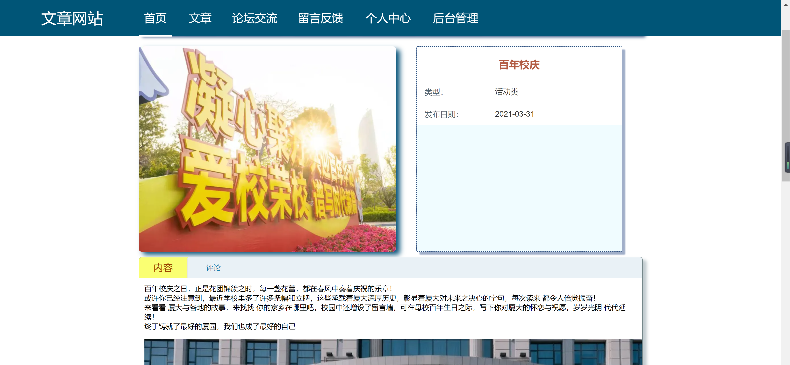
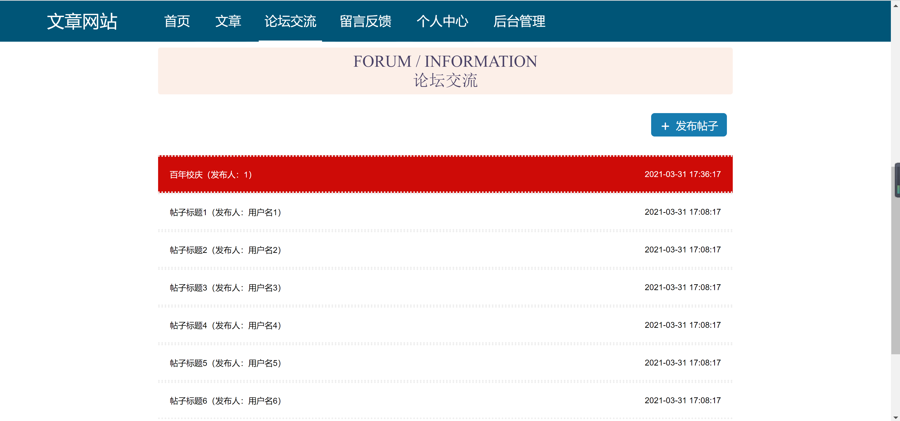
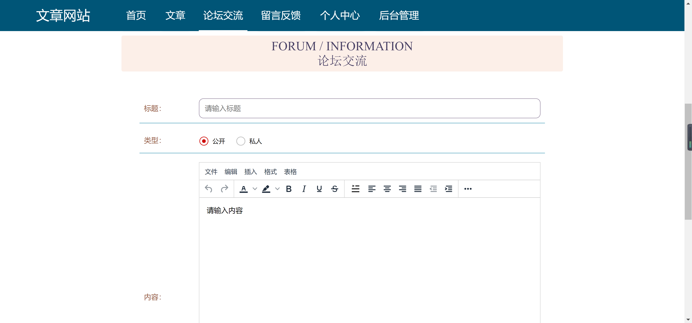
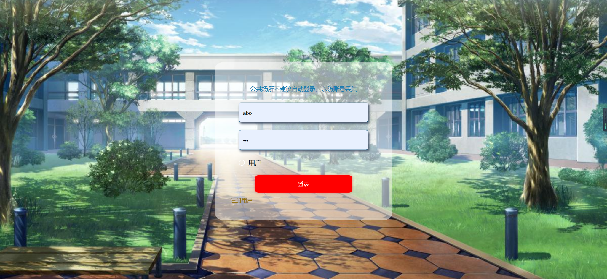
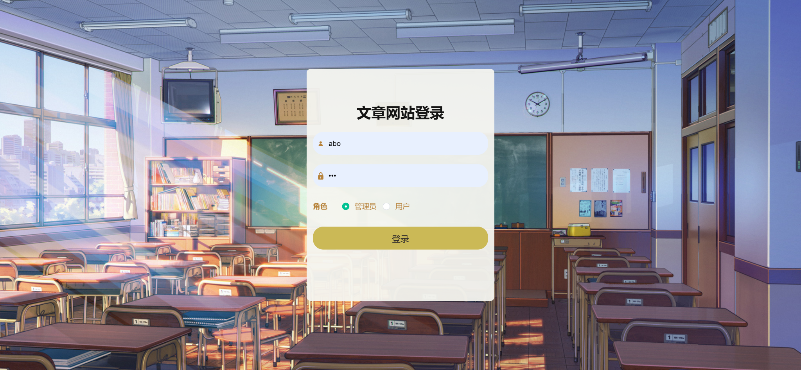
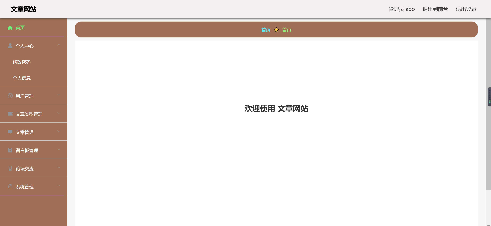
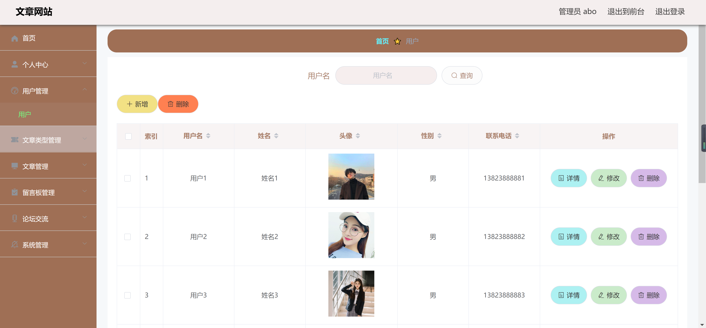
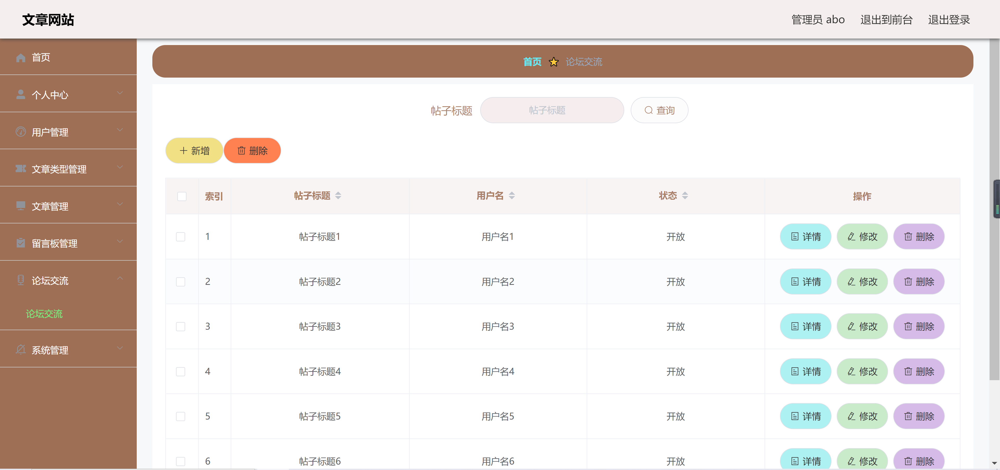

<h1 align="center">文章论坛管理系统</h1>

## 简介
文章论坛管理系统：角色分为管理员、用户；提供首页、文章管理、论坛交流、用户管理、后台管理等功能，支持发布、编辑、删除文章及用户互动，界面简洁便捷。    --计算机毕业设计源码；毕设源码；java毕业设计源码

## 联系方式

<h3 align="center">获取完整代码与数据库文件 + 微信：deepguan QQ: 86050149 QQ群: 783742310</h3>

<h3 align="center">可帮忙远程部署 包运行成功！提供远程部署、修改代码、设计文档指导、代码讲解等服务！</h3>

## 功能介绍（完整见运行截图）
管理员：基本功能包括登录、注册和退出，提供角色选择以控制权限。网站包含主导航栏，支持文章、论坛交流、留言反馈和后台管理等功能。管理功能覆盖用户管理、文章管理、留言板管理、论坛交流和系统管理，支持查看、修改和删除操作，便于高效管理内容和用户互动。

用户：基本功能提供注册和登录，具有查看和互动的权利。在个人中心，可查看和修改个人信息。在论坛交流部分，可创建新帖子并参与讨论，支持文章的标题和内容填写，并选择文章类型为公开或私人，便于与其他用户互动和共享内容。

## 运行截图

本代码来源于网络,仅供学习参考使用!

